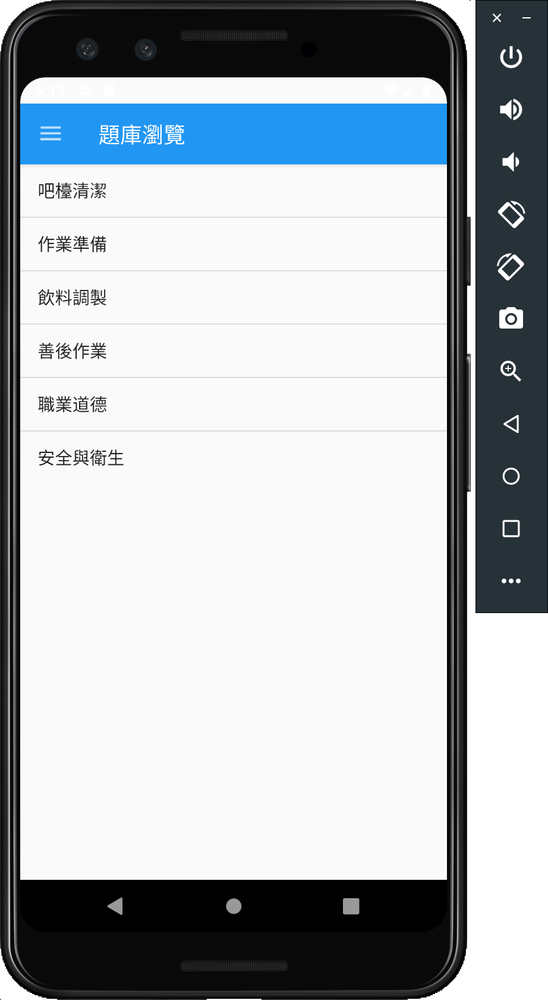
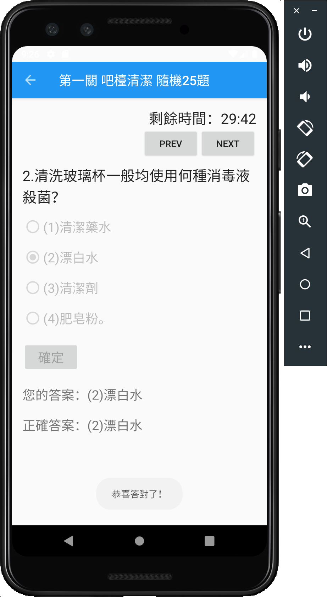

# BeveragesModulation
The app supply user to practice the C-level drink license.

* Developed the app with Java. Mainly dealing with UI and business logic. I putted SQLite file into android assets, and get information from here. 

## 主頁

## 題庫瀏覽

## 模擬試題

## 公共材料區

## 調製法

## 飲調題組

## 前置操作練習

## 調製流程

## 善後工作

## 應考錦囊

## 應檢須知

## 簡章購買、報名方式

